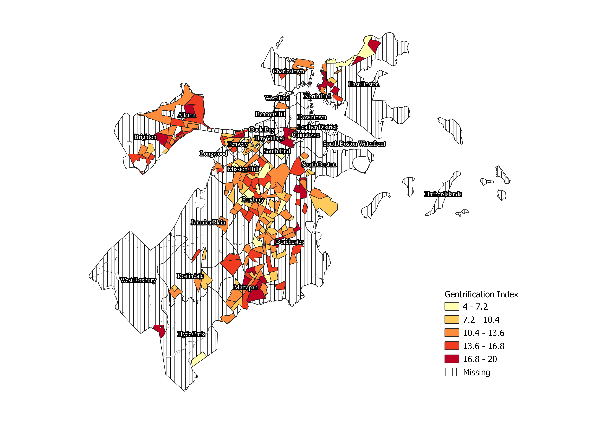

# **Mapping Gentrification in Boston: 2010-2019**

## **Executive Summary**
Over the last decade, major U.S. cities experienced large population growth, as well as more diverse. Boston Massachusetts is no exception: between 2010 and 2019, its population grew 9.4% and saw increases in nonwhite populations ([Hey, 2021](https://www.brookings.edu/research/2020-census-big-cities-grew-and-became-more-diverse-especially-among-their-youth/)). However, other studies have highlighted increasing income inequality and rising housing costs in the Boston metropolitan area ([Herman, Luberoff, Mccue, 2019](https://www.jchs.harvard.edu/sites/default/files/Harvard_JCHS_mapping_neighborhood_change_boston_january_2019.pdf)). Taken together, there have been large concerns about gentrification within Boston. Gentrification is a process of change in historically disinvested neighborhoods along economic lines, including real estate investment and higher-income households moving in, as well as changes in racial and educational attainment levels as well ([Urban Displacement Project at U.S. Berkely](https://www.urbandisplacement.org/about/what-are-gentrification-and-displacement/)). 

This project looks to visualize gentrification in Boston over the last decade. Its main output is a heatmap of gentrification in Boston at the block group level using a "gentrification index" (see details on methodology below). It can also be used to create a second map highlighting changes in low-income block groups, those whose median income were below the 2010 citywide median income of $49,893 ([Boston's People and Economy](https://www.boston.gov/sites/default/files/embed/f/fy16-volume1-bostons-people-economy.pdf)).
The data sources for this project include the Census's American Community Survey (ACS) five-year esimates, as well as geospatial data from the U.S. Census and the City of Boston. The project also includes a graph that checks for the robustness of the gentrification index when the racial indicator is removed.

## **Instructions**
The scripts should be run in the order as indicated below. All geospatial data is provided within the repository, and the ACS data is retrieved in the first script through an API call. Other data files within the repository are created by the scripts and are provided for convenience. There is also a QGIS project within the repository which was used to create the maps.

### **Script #1: get**
This script defines a function called get which makes the API request for the ACS five-year estimates and turns it into a dataframe. It then loops through the years of interest (the 2014 and 2019 ACS five year estimate) applying the get function, creates a GEOID and sets it as the index, and saves each year as a csv file for use in the next script.

The API request calls the following variables for all block groups in Suffolk County, MA. These will be used to create the gentrification index. 
1. Total population
2. Total population that is white nonhispanic
3. Median income
3. Median rent
4. Total educational attainment for the population over 25
5. Total number of individuals over 25 with a bachelor's degree
6. Total number of individuals over 25 with a master's degree
7. Total number of individuals over 25 with a professional degree
8. Total number of individuals over 25 with a doctorate degree

The function get takes one argument, year, and uses it to build and execute an API request for the Census ACS five-year estimate. It converts the result into a Pandas dataframe and returns a dataframe. 

The script then loops through the years of interest, 2014 & 2019 in this case, renames the variables, builds a GEOID and writes the results to a csv files. The outputs of the script are two csv files, "Suffolk_blckgrps_2014.csv" and  "Suffolk_blckgrps_2019.csv." The two CSV files will be used in the next script. 

### **Script #2: analyze**
The script uses the two csv files created in the previous script to build the gentrification index. It then saves the result as a new CSV. 

First, it reads in the csv files created in the get_data. It then loops through them, filling in missing data, calculating the percentage of the population that's white nonhispanic and the percentage of the population over 25 that has a bachelor's degree or higher. 

The script then builds a new dataframe, joined, that's the percentage change between the 2014 and 2019 datasets for the following variables for each block group. 
1. Percentage of the population that's nonwhite hispanic
2. Median income
3. Median rent
4. Percentage of the population over 25 with at least a bachelor's degree

Next, it loops through each column in joined, creating quintiles for each variable, and reading the result into a new dataframe called quint. Each column in quint will have a value of 1-5, with five indicating the highest quintile. Each value is summed across to create a gentrification index. The script also creates a second index that does not include the race variable. Higher values for the index indicate more gentrification. The script also creates a new dummy variable within quint that indicates whether the block group's median income was below the citywide median income in 2010. 

Finally, the script writes the quint dataframe to a csv file called "gent_by_blck_grp.csv".

### **Script #3: filter**
This script builds the geographic data needed for the map and saves it to a geopackage. The two main inputs are two shapefiles: "City_of_Boston_Boundary.zip," which contains geospatial data for the city of Boston, and "cb_2019_25_bg_500k.zip," which contains geospatial data for all block groups in Massachusetts. Both are provided in the repository. However, the boston boundary file can be downloaded from the [City of Boston's website](https://bostonopendata-boston.opendata.arcgis.com/datasets/boston::city-of-boston-boundary/explore?location=42.293424%2C-71.084336%2C12.11) and the block group data can be downloaded from the [Census's website](https://www.census.gov/geographies/mapping-files/time-series/geo/cartographic-boundary.html).

After reading in the data, the script projects both the city and block group data to utm18n, the projection used for Massachusetts ([State of Massachusetts](https://www.mass.gov/info-details/overview-of-massgis-data)). 

The script then executes two spatial joins: one with a overlaps predicate and one with a within predicate. Then it concatenates the resulting dataframes. The result is a dataframe, boston_grps, that contains all block groups that are either fully within or overlap the city of Boston. The script then clips the block groups on the city boundary data, resulting in a dataframe named boston that divides the city into block groups. 

Finally, the script creates a geopackage called boston with two layers. The first layer, city, is the boston boundary data. The second, master, is the clipped block group data. 

### **Script #4: merge**
merge has two inputs: the "gent_by_blck_grp.csv" created in script #2 and the master layer of the boston geopackage created in script #3. After reading in the data, the script joins the gentrification index data onto the geospatial data using GEOID as the key. It then writes the merged data to a new layer of the boston geopackage called "gent," as well as a new csv file called "boston_gent.csv" 

### **Script #5: check**
This script checks the robustness of the gentrification by plotting the two indexes and fitting a linear regression line using the "boston_gent.csv" file created in the previous script. 

First, it reads in the csv file drops the geographic data and block groups with missing data. 

To measure the robustness of the index, the script sorts the block groups by the gentrification index with race included and assigns it a value based on its ranking. It repeats the same process for the index that does not include race. 

The script then measures the correlation between the two rankings and plots them with a fitted regression line. The main output is the graph, which is saved as an image titled "Gent_Index_Regplot.png". The regplot shows that the two rankings are highly correlated (r=0.858232), with higher correlations at the ends of the distribution and more variation in the middle. 
